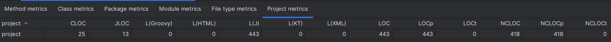
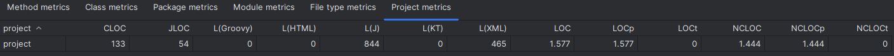
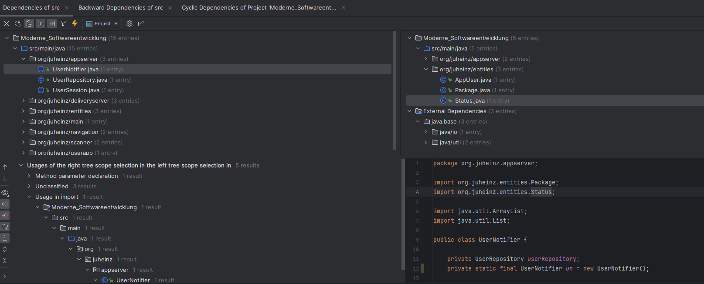
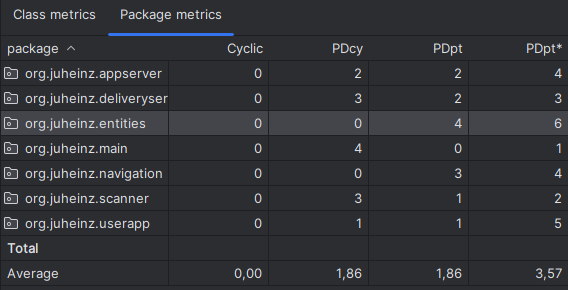
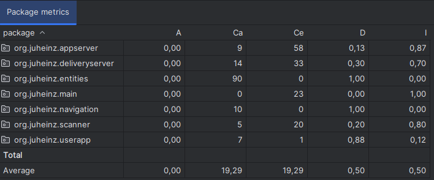
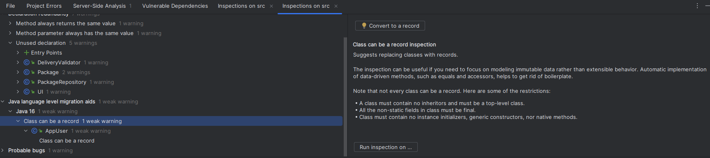
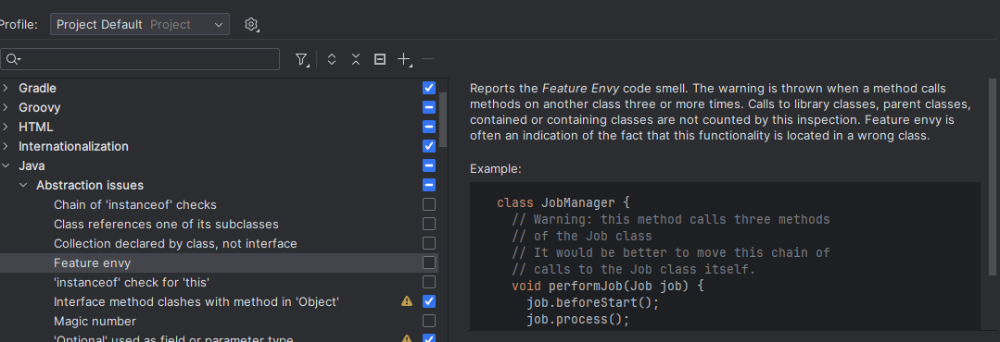

# Metriken Erfahrungen
Untersucht wurden zwei Projekte. A) "Pattern Hero": Ein Guitar Hero Clone in Java (Semesterprojekt aus Modul "Patterns und Frameworks) und B) ein Java-Mockup zu einem Package Tracking Service welches für diese Veranstaltung geschrieben wurde (in diesem Projekt unter "src").
Beide Programme sind recht kurz, ich wollte aber Projekte verwenden, in denen ich mich gut auskenne, weil ich sie selbst geschrieben habe. 
Als Tools wurden das Metrics Reloaded Plugin für IntelliJ und die in IntelliJ per default eingebauten Funktionen zur Code-Analyse genutzt.

## Lines of code
Laut Script sollen Kommentare zwischen 30 % - 60 % der LOC (lines of code) ausmachen. 

Das Tracking-Projekt hat laut Metrics Reloaded 25 CLOC (Comment lines of code) von insgesamt 443 LOC. Das entspricht nur 5%. 
Allerdings gibt das Plugin auch die Javadoc lines of code an (13). Hier ist auf erstem Blick unklar, ob diese auch zu den CLOC gezählt werden. Schaut man sich die Metric NCLOC (Non-comment lines of code) an, so sieht man, das JavaDoc wohl nicht zu den CLOC gezählt werden. 

Bei der Analyse von diesem Projekt musste ich darauf achten, einen richtigen Scope auszuwählen, der nur das Java Projekt (also den src Folder) und nicht auch Dokumente wie dieses beinhalten.  

Das Pattern Hero Projekt hat laut dem Plugin 133 CLOC und 54 JLOC von insgesamt 1577 LOC. Das entspricht einem Kommentaranteil von ca. 8%. 

Schade bei diesem Tool ist, dass man die Prozentzahl der jeweiligen Kategorien selbst ausrechnen muss und nicht sofort ersichtlich ist, wie die Kategorien genau zustande kamen. 
IntelliJ selbst besitzt diese Funktion nicht, soweit ich finden konnte.

### Fazit Lines of Code
Rechnet man die Anzahl der Kommentarzeilen aus, entsprechen beide Projekte also nicht dem Best-Practice Anteil, auch nicht, wenn man Javadoc als Kommentare zählt. Dies überrascht mich, denn im Vergleich zu meinen Kollegen auf der Arbeit habe ich das Gefühl, dass ich sehr viele Kommentare schreibe. Nun stellt sich heraus, dass ich mindestens vier mal so viele Kommentare schreiben muss, um der unteren Grenze der Empfehlung zu entsprechen.   

## Dependencies
Im Dependency Viewer von IntelliJ erhält man keine Statistik zu den Abhängigkeiten, sondern kann diese in einer GUI untersuchen. Man wählt im linken und rechten Fenster je ein Package oder eine Klasse aus. Darunter erscheint dann, wo die rechte Auswahl in der linken Auswahl verwendet wird.
Die Anzahl der Afferent Couplings erhält man nur zwischen zwei ausgewählten Elementen. Es gibt keinen Gesamtüberblick über die Dependencies, sondern nur praktische Änderungshilfen für konkrete Fälle. 

Metrics reloaded zeigt dagegen rein als Tabelle auf, wie viele Pakete von einem anderen Paket (PDpt) anhängig sind. Diese Statistik gibt es auch auf Klassenebene. Das Plugin erlaubt es so einen Gesamtüberblick über die Abhängigkeiten zu schaffen, bietet jedoch keine praktische Änderungshilfe. Es dient also zur groben Analyse und Festhalten von Statistiken.

Noch tiefer in die Dependency-Metriken kann man bei Metrics Reloaded unter "Martin packaging metrics" einsteigen. Dort kann man auch die Abstraktheit (A), die Instabilität (I) und den Abstand zum Hauptstrang (D) als Statistik auf Package-Ebene einsehen. Hier habe ich erfahren, dass ich bisher immer nur konkrete Klassen geschrieben habe, was aber auch an der kleinen Projektgröße liegen könnte.  
Interessant ist auch herauszufinden, dass meine Pakete wohl recht instabil sind, denn die durchschnittliche Instabilität liegt bei beiden Projekten bei 0,5. Manche Packages haben sogar eine Instabilität von 0,8 oder höher. Das gibt mir einen Denkanstoß dazu, dass ich hier mal meine Architektur ändern muss.

Beide Tools können ebenfalls Abhängigkeitszyklen analysieren, wobei Metrics Reloaded wieder nur einen statistischen Überblick gibt und IntelliJ wieder nur die konkreten Code-Stellen anzeigt.

### Fazit Dependencies
Hier lohnt es sich auf jeden Fall die beiden Tools zu kombinieren. Metrics Reloaded erlaubt es mit seiner Statistik schnell sichtbar zu machen wie es um den Grad der Abhängigkeit im Gesamtprojekt steht. Anschließend kann man den Dependency Inspector von IntelliJ verwenden, um den genauen Ort der Abhängigkeiten im Code zu finden. 

## Regelverletzungen
IntelliJ ist mit Inspect Code sehr gut darin, Regelverletzungen und weitere potentielle Probleme zu finden. Ich benutze diese Funktion täglich auf der Arbeit. Hier gibt es viele hunderte mögliche Kategorien an Warnungen die eine Inspektion ausrufen kann.
Diese werden mir auch oft während der Programmierung schon angezeigt, so dass ich die Warnungen meist sofort beseitigen kann. 
Besonders intelligent finde ich, wenn IntelliJ erkennt dass Code, den ich geschrieben habe durch ein neueres Java-Feature gekürzt oder verbessert werden kann. Aber auch einfache Hinweise wie, dass eine Variable static oder local sein kann helfen mir meine Codequalität zu verbessern. 

Meine Kollegen und ich haben auch einen gemeinsamen Code Style in IntelliJ festgelegt (z.b. wie breit ist eine Einrückung, wo darf ein Leerzeichen stehen) und diese dann in unsere IDEs importiert. IntelliJ kann Code automatisch nach diesem Standard formatieren oder während der Code Inspektion Verletzungen anzeigen.

Diese Aufgabe hat mich dazu bewegt mir die Einstellungen für die IntelliJ Inspektion mal näher anzuschauen. Interessant finde ich, dass IntelliJ auch abstraktere Probleme findet, die gegen gute Programmierpraktiken verstoßen. Zum Beispiel weißt es darauf hin, wenn Magic Numbers verwendet werden oder eine Klasse zu viele Methoden einer anderen Klasse aufruft ("Feature Envy"). Erst durch stöbern in den Einstellungen habe ich erfahren, warum diese Vorgehensweise problematisch ist. 

### Fazit Regelverletzungen
Die Code-Inspektion von IntelliJ ist sehr intelligent und ich will nie wieder in einem IDE arbeiten, das nicht mindestens das gleiche Level an Features hat. 

