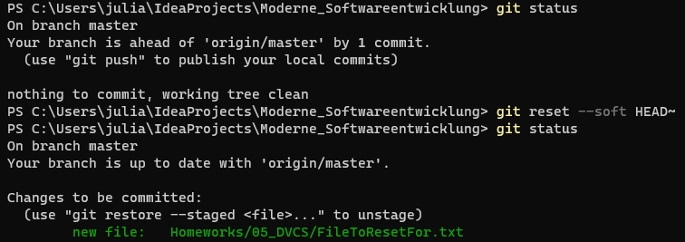
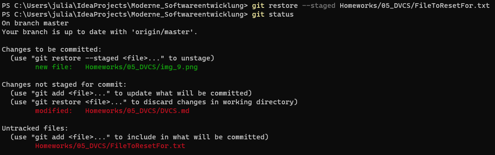
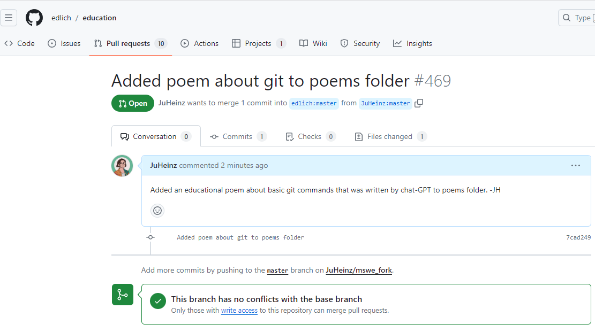

# DVCS Log

## Branch erstellen
Erstellen von Branch "homework-5" aus Branch "master".

##  Add & status

## Move (mv)

## Commit

## Diff

## Remove (rm)

## Push

## Pull 
Pullen von Änderungen nach commit von meinem Freund.

## Merge
Branch "homework-5" wieder in master zurück mergen.

## Zeitreisen: Reset
Ungepushten Commit zurücknehmen, Branch auf vorherigen Commit zurücksetzen.

## Zeitreisen: Restore
File unstagen.

## Pull Request
Forken von https://github.com/edlich/education. Datei hinzugefügt. 
Pull Request mit Nr. #469
