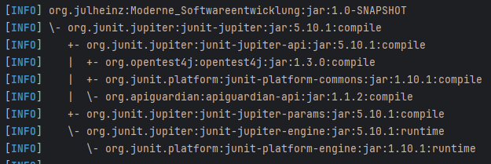

#  Buildmanagementstools - Erfahrungen
Bisher habe ich nur indirekt oder unbewusst Buildmanagement-Tools gearbeitet.

Maven ist das Buildmanagement-Tool bei den Softwareprojekten in meiner Werkstudentenstelle,
da ich dort aber noch nicht deploye oder mit Tests arbeite,
habe ich kaum bewusste Berührungspunkte mit dem Tool. 

Im Rahmen dieser Aufgabe werde ich die Features von Maven erkunden und meine
bisher kaum vorhandenen Kenntnisse mit Testing und Building im Allgemeinen erweitert.

## Projekt Setup
Bisher habe ich meine Java Projekte immer mit Maven via einem IDE Setup-Dialog aufgesetzt.
Deshalb war mir gar nicht bewusst, welche Prozesse zum Projekt-Setup von Maven kommen vs. was das IDE übernimmt. 
Um dies Herauszufinden habe ich IntelliJ ein Projekt mit Maven und eines ohne Buildmanagement Tool aufsetzen lassen.

Maven generiert die Directory Struktur für das Java Projekt mit dem mir bereits bekannten src/main/java Muster.
Ich wusste bisher nicht, dass dies von Maven aufgesetzt wird. Es erstellt ebenso die git.ignore-File und die Test- und Resources-Ordner.

## Dependency Management
Dies ist der einzige Teil von Maven der mit bereits bekannt war
da ich auf der Arbeit bereits Dependencies eingefügt und verändert habe.

Der Prozess ist recht einfach, das Hinzufügen der JUnit Library zum Projekt umfasste beispielsweise nur das copy-pasten von einem XML-Snippet
in die pom.xml-File.
Maven hat die Dependency dann automatisch als external library heruntergeladen.

Meines Verständnis nach müsste ich die JAR File ohne Maven manuell herunterladen und dem classpath hinzufügen.

Eine interessante Info ist der dependency tree `mvn dependency:tree`, wenn ein Projekt viele Dependencies hat, ist dies sicherlich sehr hilfreich. Ich werde das mal auf der Arbeit ausprobieren.

## Testen 
Da ich bisher keine Testerfahrung habe aber weiß, dass ich dies lernen sollte habe ich mir für diese Aufgabe die Basics
von Testen mit JUNIT beigebracht und kurze Tests für die Klassen in diesem Repository geschrieben.

Mit `mvn test` konnte ich diese Test dann automatisch laufen lassen. 

## Package
Bisher habe ich Code noch nie gepackaged, da ich meine eigenen Programme immer nur aus dem IDE heraus laufen lasse
und das das Teilen mit anderen über Link zum Source-Code repository stattfindet.

Mit maven war diese Aufgabe aber via `mvn package` sehr einfach und eine jar Datei war in Sekunden erstellt.
Ich habe auch damit experimentiert den Wert für `<packaging>` in `pom.xml` von jar zu war zu verändern um zu sehen was passiert.
Zwischendurch habe ich das target directory leicht mit `mvn clean` löschen können. 

## Fazit
In dieser Übung habe ich viel gelernt. Eigentlich war die Übung dafür gedacht den Entwicklungsprozess mit einem 
Buildmanagement Tool kennenzulernen. 
Da ich allerdings bisher nie ohne Buildmanagemnt-Tool gearbeitet habe, war mein Erkenntissgewinn das 
Wissen darüber was solche Tools überhaupt tun, wenn ich im IDE einen Klick tätige. 

Bisher war Maven eine Blackbox für mich. Ich wusste, dass es dafür Verantwortlich ist, dass unser Projekt auf 
der Arbeit mit all seinen Dependencies läuft, aber wie oder warum dies geschieht war quasi Magie für mich.

Nach dem Außeinandersetzen mit Maven habe ich nun ein besseres Verständnis und eine Wertschätzung für die 
Prozesse die eine komplexe Anwendung entwicklerfreundlich zum Laufen zu bringen. 
