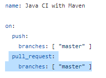
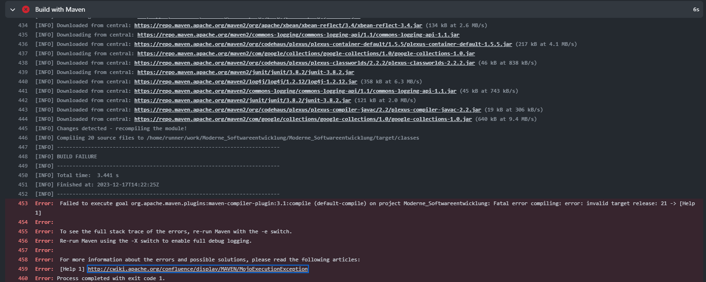
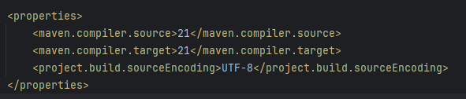

## CICD Workflow mit Github Actions

Für dieses Repository habe ich einen Github Actions Workflow aufgesetzt, der mein Maven Java Projekt nach jedem Commit auf den Master
branch baut und testet. 
Dafür habe ich unter Github Actions die Vordefinierte Action "Java with Maven" angepasst.

Aus dem Default Code habe ich das Event für Pull Requests entfernt,
da dies bei diesem repository nicht passieren wird.

Beim Ausführen des Skripts bin ich auch ein Problem mit Maven Plugin gestoßen weshalb der Workflow nicht richtig funktioniert hat.

Diese Fehlermeldungen hatte ich bereits beim lokalen benutzen von Maven, dort waren sie allerdings nur Warnungen und der Build lief ohne Problemne, weshalb ich die Warnungen ignoriert hatte.

Nach etwas Recherche habe ich herausgefunden, dass der Fehler im pom.xml zu finden ist.
