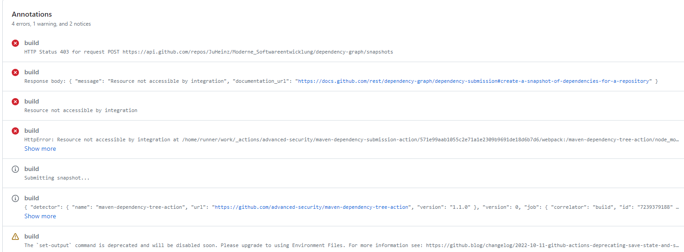
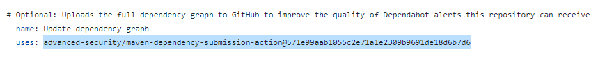
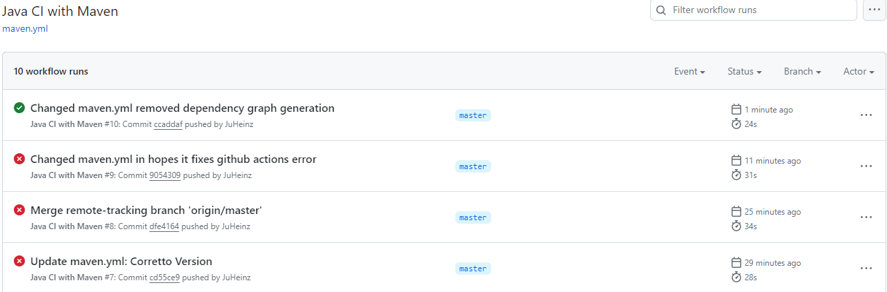
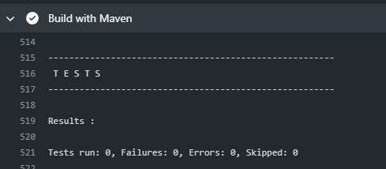
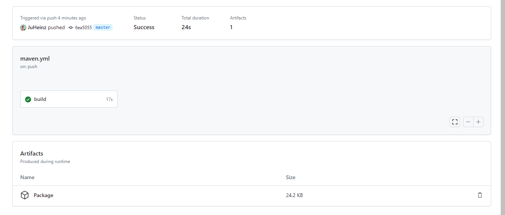

## CICD Workflow mit Github Actions

Für dieses Repository habe ich einen Github Actions Workflow aufgesetzt, der mein Maven Java Projekt nach jedem Commit auf den Master
branch baut und das JAR zum Herunterladen verfügbar macht.
Der Workflow ist in `.github/workflows/maven.yml` definiert.

## Setup
Dafür habe ich unter Github Actions die vordefinierte Action "Java with Maven" genutzt und angepasst.

Aus dem Default Code habe ich das Event für Pull Requests entfernt, da dies bei diesem repository nicht passieren wird.

## Probleme

### Problem mit JDK
Beim Ausführen des Skripts bin ich auf ein Problem mit dem Maven Compiler gestoßen
weshalb der Workflow gefailed ist.

Nach etwas Recherche habe ich herausgefunden,
dass der Fehler daran liegt dass im Github Actions Workflow Skript die Java
Version 17 in Distribution "temurin" vorgegeben war, ich in meinem Projekt jedoch Openjdk in Version 21.0.1 verwende.
Nach Ändern der Distribution und Version im Workflow Script zu Openjdk 21.0.1 bekam ich einen neuen Fehler, was immerhin Fortschritt ist.

Nun war das Problem, dass openjdk nicht von der Github Action setup-java@v3 unterstützt wird,
die in dem Skript per default eingesetzt wird.
Ich habe mir die Dokumentation der Action angesehen und das JDK von meinem Projekt zu einer
unterstützen JDKs und Version (corretto 21) geändert.

Danach war der Fehler endlich in einer neuen Phase des builds zu finden. 

### Problem mit Dependency Graph Action 
Die per Default im Workflow Skript eingefügte action um einen Dependency Graph zu erstellen hat Fehler ausgelöst.
Deshalb musste ich die action aus Zeitgründne leider entfernen und durch das einfache `-run: mvn dependency:tree` ersetzen. 

Anschließend wurde die Action nach 10 Versuchen endlich erfolgreich ausgeführt. 

### Problem mit Tests
Beim Untersuchen des Logs musste ich allerdings feststellen, dass während der Build Action keine Tests ausgeführt werden,
obwohl 2 JUNIT Tests im Projekt existieren, die mit `mvn test` auch lokal laufen.

Leider konnte auch nach einer Stunde Recherche diesen Bug nicht fixen, weshalb er aus Zeitgründen leider erstmal bestehen bleiben muss.
Dies ist aber auf jeden Fall etwas, dem ich mich in Zukunft widmen will, da Tests sehr praktisch sind.

## Output
Bisher macht dieser Worklow nur folgendes: er checkt den main Branch aus, installiert Java auf der einer Virtual Machine,
packaged das Projekt und erstellt einen Dependency Graph.

Als nächstes wollte ich durch Github Actions das erstelle JAR herunterladen können. Dafür habe ich die Action
`actions/upload-artifact@v3` verwendet, was funktioniert hat. Ich konnte die JAR anschließend auf Github herunterladen.

Diese Artefakte könnte ich in Zukunft auch für Testrepots oder den Dependency Graphs verwenden,
sobald ich diese Actions zum Laufen gebracht habe. 

## Fazit
Da ich mich bisher gar nicht mit CI/CD beschäftigt habe, waren die meisten Aspekte dieser Aufgabe neu für mich.

Auch wenn ich es innerhalb dieser Aufgabe nicht geschafft habe, eine volle CI/CD Pipeline zu erstellen, weiß ich nun immerhin
die Grundfunktionen von Github Actions. 

Sollte ich mich in Zukunft weiter in mit CI/CD Prozessen beschäftigen, so habe ich nun ein Grundwissen auf dem ich in Zukunft
mit komplexeren Projekten und Deployment Strukturen aufbauen kann.  
